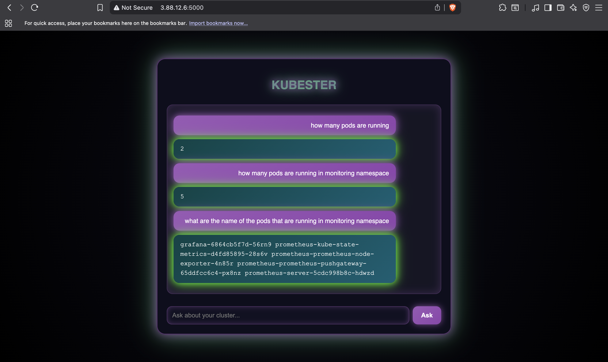

# Project Working Screenshots

Here are some working screenshots of the project:

## Screenshots

### Screenshot 1


### Screenshot 2


### Screenshot 3


# K8S-ASSISTANT

K8S-ASSISTANT is an AI-powered web application that allows users to interact with their Kubernetes clusters using natural language. It translates user questions into `kubectl` commands using AWS Bedrock's Claude model, executes them, and returns the results in a modern chat interface.

---

## Features

- Conversational UI for Kubernetes management
- Converts natural language to `kubectl` commands using Claude (AWS Bedrock)
- Secure execution of commands on your cluster
- Modern, cyberpunk-inspired frontend
- Deployable on Kubernetes or run locally

---

## Architecture Overview

```
┌────────────┐      HTTP       ┌────────────┐      AWS Bedrock API      ┌────────────┐
│  Frontend  │ ──────────────▶│  Backend   │ ────────────────────────▶│   Claude   │
│ (HTML/CSS) │   (User Qs)    │ (Flask)    │   (NL→kubectl command)   │  (LLM)     │
└────────────┘◀───────────────└────────────┘◀────────────────────────└────────────┘
	  ▲             │   ▲             │   │
	  │             │   └────────────▶│   │
	  │             │   (kubectl)    │   │
	  │             └────────────────┘   │
	  │                 (K8s Cluster)    │
	  └──────────────────────────────────┘
```

---

## UML Sequence Diagram


---

## How It Works

1. **User** enters a question (e.g., "How many pods are running?") in the web UI.
2. **Frontend** sends the question to the backend via a POST request.
3. **Backend** uses AWS Bedrock's Claude model to translate the question into a `kubectl` command.
4. The backend **executes** the generated command on the Kubernetes cluster.
5. The **output** is returned to the frontend and displayed in the chat.

---

## Setup & Installation

### Prerequisites

- Python 3.10+
- `kubectl` configured and access to a Kubernetes cluster
- AWS credentials with access to Bedrock (Claude)
- Docker (optional, for containerized run)

### 1. Clone the Repository

```bash
git clone https://github.com/awsdeployer/K8S-ASSISTANT.git
cd K8S-ASSISTANT
```

### 2. Backend Setup

Install dependencies:

```bash
cd backend
pip install -r requirements.txt
```

Set AWS credentials (ensure Bedrock access):

```bash
export AWS_ACCESS_KEY_ID=your-key
export AWS_SECRET_ACCESS_KEY=your-secret
export AWS_DEFAULT_REGION=us-east-1
```

Run the backend:

```bash
python app.py
```

### 3. Frontend

Open `frontend/index.html` in your browser, or access via `http://localhost:5000` if running backend locally.

### 4. Docker (Optional)

Build and run the container:

```bash
docker build -t k8s-assistant .
docker run -p 5000:5000 --env AWS_ACCESS_KEY_ID --env AWS_SECRET_ACCESS_KEY --env AWS_DEFAULT_REGION k8s-assistant
```

### 5. Kubernetes Deployment

Apply the manifests in the `k8s/` directory:

```bash
kubectl apply -f k8s/deployment.yaml
kubectl apply -f k8s/service.yaml
```

Expose the service and access via NodePort or LoadBalancer as configured.

---

## Configuration

- **AWS Credentials**: Required for Bedrock API access. Set as environment variables or Kubernetes secrets.
- **Kubernetes Access**: The backend must have `kubectl` access to the target cluster.
- **Claude Model**: Uses `anthropic.claude-3-5-sonnet` via Bedrock.

---

## Usage

1. Open the web UI.
2. Type a natural language question about your Kubernetes cluster.
3. View the response and `kubectl` output in the chat.

---


## License

This project is for educational and demonstration purposes. See `LICENSE` for details.

